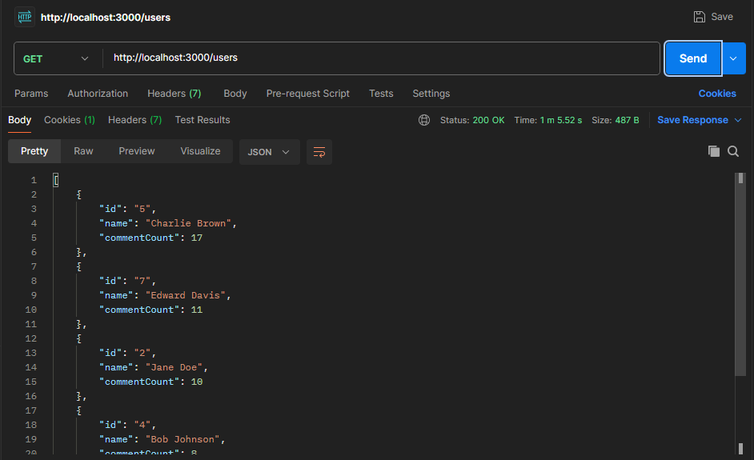
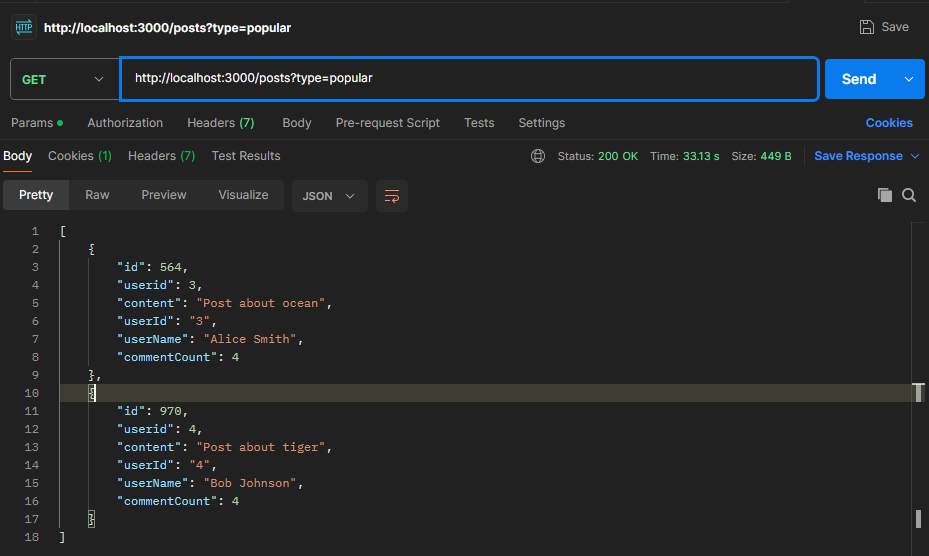
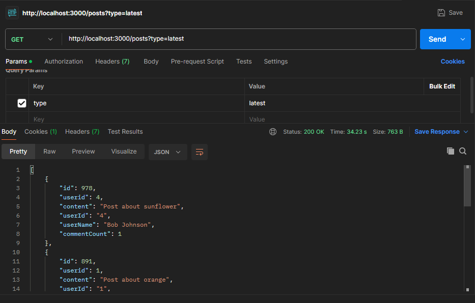

# Social Media API Service

This is a microservice that provides endpoints to get top users and posts from a social media platform.

## API Documentation

### Get Comments API


### Endpoints

1. **Get Top Users**
   - `GET /users`
   - Returns top 5 users with the most commented posts
   - Response: Array of users with their comment counts
   

2. **Get Posts**
   - `GET /posts?type=<type>`
   - `type` can be:
     - `popular`: Returns post(s) with maximum comments
     - `latest`: Returns 5 most recent posts
   - Response: Array of posts with comment counts
   
   
   

## Setup

1. Install dependencies:
```bash
npm install
```

2. Start the server:
```bash
node src/index.js
```

## Example Usage

```bash
# Get top 5 users
curl -X GET "http://localhost:3000/users"

# Get popular posts
curl -X GET "http://localhost:3000/posts?type=popular"

# Get latest posts
curl -X GET "http://localhost:3000/posts?type=latest"
```

